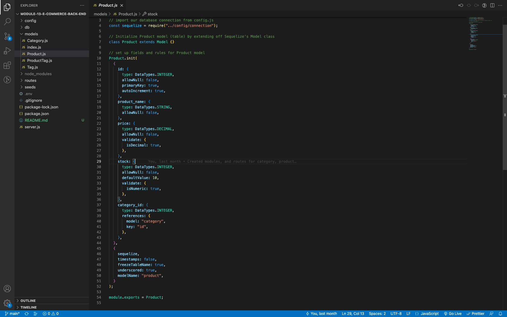

# E-Commerce Backend



## Description

This project involved creating the backend for a mock e-commerce application. Main focus was the setting up of the database using an Object Relational Mapper (Sequelize) and creating correct routes using express.

Concepts applied to this project include:

- Setting up sequelize to create database with correct assoications between tables
- Creating seed data that populates tables correctly
- Setting up a working express server
- Creating a RESTful working api

_Link to Walkthrough video:_ [Walkthrough Video]()

## Table of Contents

- [Installation](#installation)
- [Usage](#usage)
- [How to Contribute](#how-to-contribute)
- [Test](#test)
- [Questions](#questions)
- [License](#license)

## Installation

Open the command line and navigate to the folder containing the application. Download the node dependencies with

```bash
npm install
```

Start the application with

```bash
npm start
```

## Usage

Once server is started, use insomnia, postmates, or browser to put in requests to the api

## How to Contribute

N/A

## Test

N/A

## Questions

Github: https://www.github.com/jaredstaples50<br>
Email: jared.e.staples@gmail.com

## License

[](https://opensource.org/licenses/MPL-2.0)
